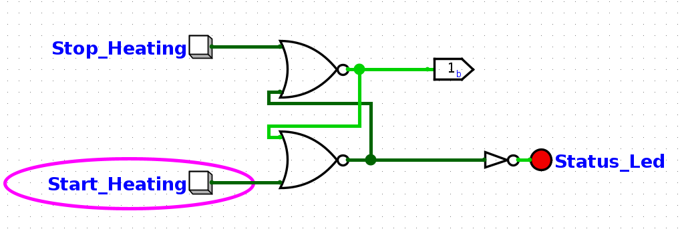
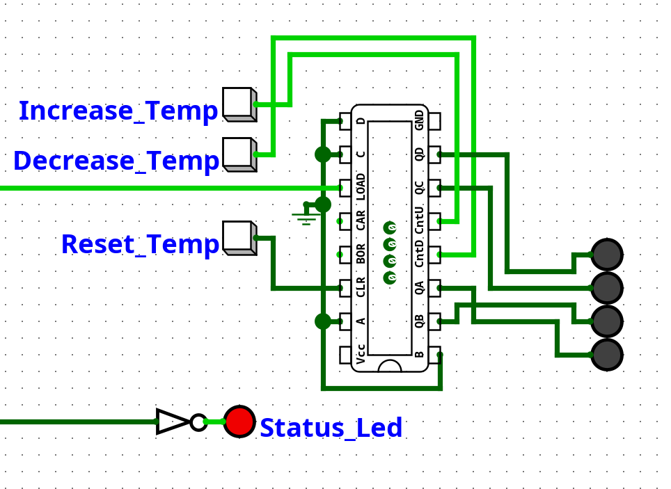
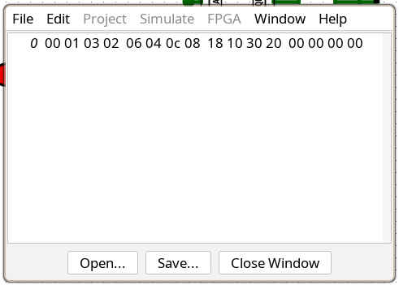
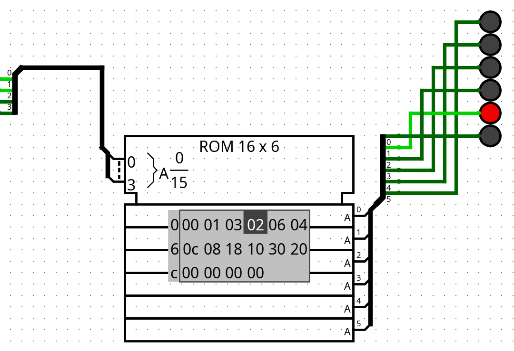
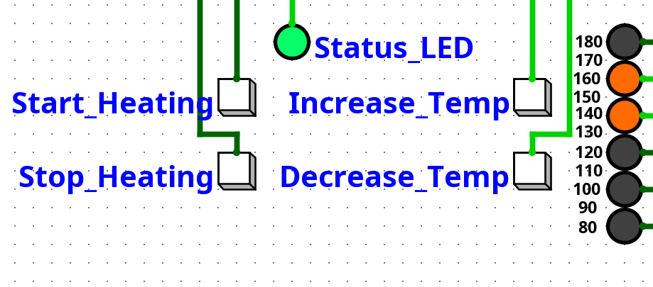

# Start and stop, heating buttons

For the start and stop buttons, I want the following behaviour:

- Start is pressed and the output signal is set to high.
- The output signal stays high until stop is pressed.
This behaviour can be achieved using a SR-Latch.

### SR-Latch

Truth-table for SR-Latch

| S   | R   | Q     | Q'    |
| --- | --- | ----- | ----- |
| 0   | 0   | Latch | Latch |
| 0   | 1   | 0     | 1     |
| 1   | 0   | 1     | 0     |
| 1   | 1   | 0     | 0     |

Here is the logic of my SR-Latch. I used a NOR gate SR latch because it is set when the inputs go from low to high which fits nicely with buttons, and saves two NOT gates. When `Start_Heating` is pressed the bottom NOR gate output goes low, causing the top gate to output high which keeps the output of the bottom gate low creating a latch. The same mechanism happens when `Stop_Heating` is pressed but in the opposite direction.\

# Controlling the Temperature

The temperature is controlled with two buttons (increase and decrease) and has 11 different settings from 80-180 C. When the increase button is pressed the controller will count up from the current setting, and down when the decrease button is pressed.

## Counting

I will use a `74193` 4-bit up/down binary counter using the temperature control buttons to actuate a count up and down cycle.

The `74193` chip has the following pins:

- `CLR`: Active high, immediately clears the count to zero.
- `DATA`: A, B, C, D are input pins, the value of these will be loaded into the counter.
- `LOAD`: Active low, the value on the DATA inputs is loaded into the counter overriding counting.
- Count `CntU/CntD`: These pins count up and down. They activate on a low-to-high transition when the other pin is also set to high.
- `Q` Outputs: `QA`, `QB`, `QC`, `QD` 4 bit-binary output of the current count.
- `BORROW`: Output goes LOW when the counter underflows (e.g., counts down past 0).
- `CARRY`: Output goes LOW when the counter overflows (e.g., counts up past 15/F).

Using that information I wired the chip in Logisim as follows:

- I connected the load to the SR-Latch's output signal and all the inputs to ground. That way when `Stop_Heating` has been pressed 0 is loaded to all bits.
- I placed a button to clear the counter, for testing purposes. Note the controller design doesn't include a reset temp button, it could be a useful addition.
- For `Increase_Temp` and `Decrease_Temp` I inverted the buttons so they output high passively and low when pressed.\

# Displaying the Temperature

Now that the counter is implemented I need to convert the output of the counter into a signal for 6 `LED`s. This can be achieved with a decoder, specifically I will be using the ROM component.
In a ROM is Read-Only Memory and I can use it to map the 4-bit counter value to the specific 6 signal pattern for that setting.
I chose a ROM because it is easy to setup for this exact kind of custom decoding.

## Setting up the ROM

1. I set the address bit width to 4 and the data bit width to 6.
2. I used a splitter to combine the 4 outputs of the counter and hooked it up to the address input. To test if this was working I incremented the counter and the selected address on the ROM incremented each time.
3. I put another splitter on the output of the ROM to split the outputs into 6 lines for each LED.
Now with the ROM wired I need to program the address table. Each address will output the hexadecimal number stored there in binary.

I came up with the following address table:

| Addr | Data   | Desc |
| ---- | ------ | ---- |
| 0    | 000000 | Off  |
| 1    | 000001 | 80C  |
| 2    | 000011 | 90C  |
| 3    | 000010 | 100C |
| 4    | 000110 | 110C |
| 5    | 000100 | 120C |
| 6    | 001100 | 130C |
| 7    | 001000 | 140C |
| 8    | 011000 | 150C |
| 9    | 010000 | 160C |
| 10   | 110000 | 170C |
| 11   | 100000 | 180C |

Converting the binary data to hexadecimal I got the following address table in Logisim:\
\
Testing this address table produced the expected output and the `LED`s lit up in the correct pattern as the counter was incremented.\

# Handling overflow

Now that we have the counters signal converting to a signal for the `LED` display, theirs one problem that needs to be addressed. What should happen when the counter goes above the final temperature setting? I reckon once the highest temperature setting is gone beyond the counter should reset to 0.

I have come up with an elegant solution, that doesn't require any new components. To solve this problem I set the output of the ROM to a width of 7 bits and hooked the 7th bit into the counter's `CLR` pin.  Then in the 13th entry of the address table I set the value `0x40` which means that once the counter increments past the last temperature setting the 7th output bit will actuate the `CLR` pin in the counter resetting it.
Note: Decrementing the counter below zero won't set the temperature to high, it will instead address the last 3 empty entries before hitting `0x40` and going back to zero. This gives the controller a shortcut to cutting off heating while not letting the user go straight to full heat going back the other way.

# Finishing Up

Now that all the controls are implemented I moved the controls and display to an easily accessed location.\

