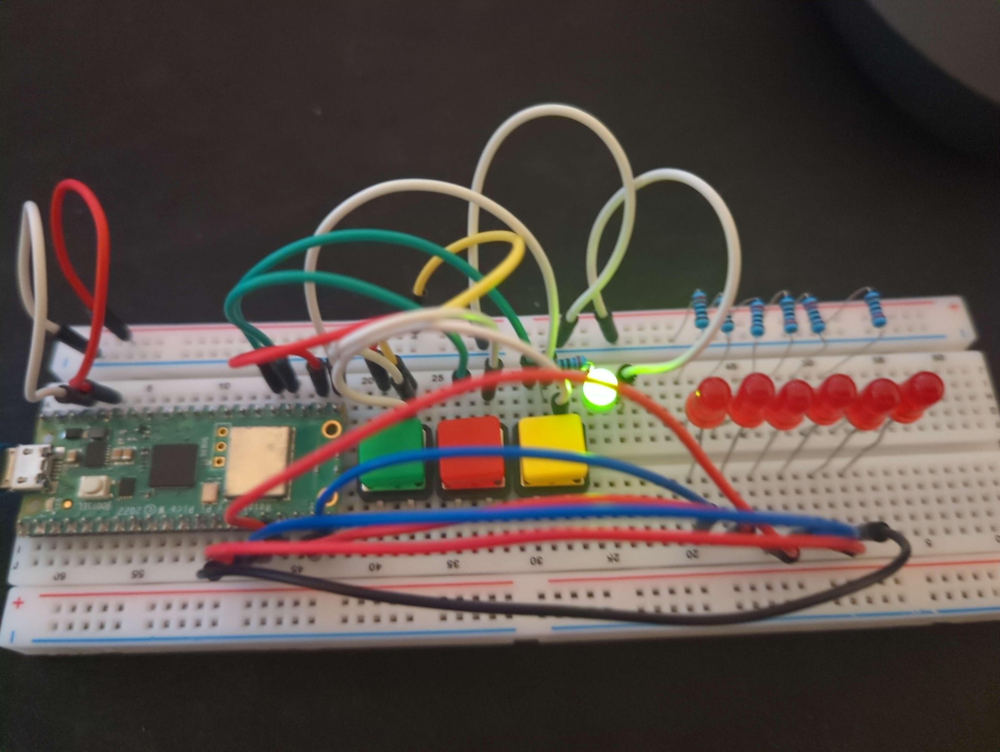
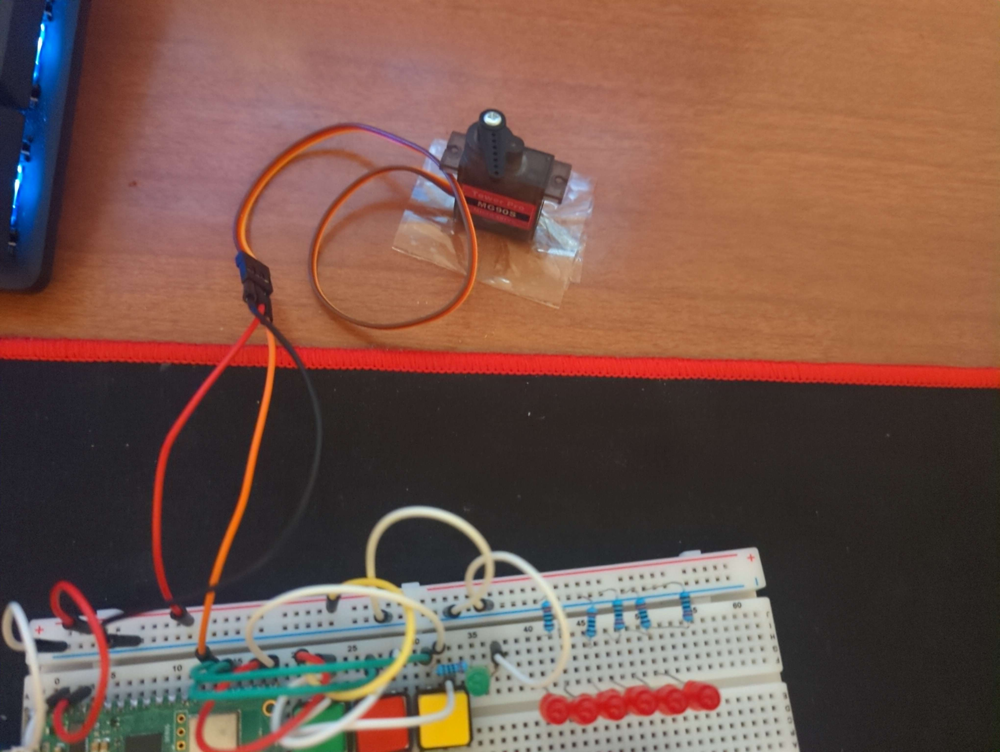

# Task 1

## Scheduler

I need a way to accurately manage when a process is executed on the Pico, otherwise everything would execute as fast as the chip could process the instructions.
The best way to achieve this is using a monotonic timer, which allows for the illusion of asynchronous execution of processes, and much finer control on timings than using `time.sleep()`.

The heart of this method is using the `time.monotonic()` function, which returns the elapsed time in seconds. I can use this function to calculate the time between each cycle and add that value to a variable to keep track of the elapsed seconds.

```python
last = time.monotonic()
elapsed = 0.0
while True:
    now = time.monotonic()
 dt = now - last
 last = now
```

The next thing I want is a system for managing processes that is easily expandable, and shouldn't need any new code outside of the process itself. I made a system like this using python's class inheritance system.

I defined a base Process class that keeps track of the time elapsed since the last execution, and how much time should elapse between executions. This class has an `execute` method that will be overridden by other inherited processes.

```python
class Process:
 # 'elapsed' is the elapsed time in seconds between executions
 def __init__(self, elapsed: float):
  self.elapsed = elapsed
  # time since last execution
  self.since = 0.0
 
 # returns true when enough time has elapsed
 def increment(self, dt: float) -> bool:
  self.since += dt
  return self.since >= self.elapsed
 
 def reset(self):
  self.since = 0.0
  
 def execute(self):
  pass
```

Next I defined a global array `processes` that will hold all the processes that need to be executed and then I can easily iterate all of these processes in the main loop and execute them when appropriate.

```python
for process in processes:
 if process.increment(dt):
  process.execute()
  process.reset()
```

### Usage Example

To test if this works lets create a simple process that controls the onboard LED. It will turn the LED on and off every 2 seconds.

```python
class LedProcess(Process):
 def __init__(self):
  super().__init__(2.0)  
  self.led = digitalio.DigitalInOut(board.LED)
  self.led.direction = digitalio.Direction.OUTPUT

 def execute(self):
  self.led.value = not self.led.value
```

I then added it to `processes`.

```python
# list of active processes
processes = [
 LedProcess()
]
```

## Polling

Now that the monotonic timer has been implemented, I need a way to check for input (On/Off, Temp_Up/Temp_Down), I considered a couple options.

1. Polling: Check if the value for a pin has changed every cycle, and execute a corresponding process.
 - Pros:
  - Simple to implement, and easy to understand.
  - Deterministic timing
  - Debouncing is easy to integrate, by adding a `time.sleep` call
 - Cons:
  - Latency: The worse-case response time to a button press is the time it takes to complete a cycle.
  - Inefficient: The CPU is always doing work regardless if it has to.
2. AsyncIO with Interrupts: this method uses hardware interrupts, and assigns a callback function to a pin.
 - Pros:
  - Instant Response
  - Power efficiency
  - Works with blocking code, even if the main loop is stuck in a long process the interrupt will still fire.
 - Cons:
  - Greater code complexity and harder to debug
  - `ISR` Danger, code inside the interrupt must be kept short and fast. Memory should not be allocated (`lists, strings, print calls`)
  - Debouncing harder to implement.
  - Shared state risks, because an interrupt is asynchronous it can lead to data races if two processes are trying to access the same data.

While interrupts are great for more complex controllers, simplicity will be preferable for this project, as it won't be running any long tasks that will majorly effect latency. Another reason is debouncing will be a lot easier to implement, and I am already not very experienced with micro-controllers or electronics.

### Implementation

Before writing any code I first setup wired some buttons to the Pico.
![[wiring-buttons.jpg]]
Connections:

- `GP16` - green status led.
- `GP17` - On/Off toggle green button.
- `GP18` - `Temp_Down` red button.
- `GP19` - `Temp_Up` yellow button.

I have decided that I will make a generic input handler class inherited from `Process`, that I can provide multiple input pins (so both temperature control buttons can be handled in one process), a callback for events (`PRESSED/RELEASED`). Another class for handling button input and debouncing will also be used in the input handler.

#### Button Class

```python
class ButtonState:
    PRESSED = 0
    RELEASED = 1
    DEBOUNCE = 2

class Button:
    DEBOUNCE_THRESHOLD = 0.05 # Time (s) to wait for button output to stabilise
    COOLDOWN = 0.2 # Time (s) to wait after an event before polling again

    def __init__(self, pin):
        self.btn = digitalio.DigitalInOut(pin)
        self.btn.direction = digitalio.Direction.INPUT
        self.state = ButtonState.RELEASED
        self.debounce_timer = 0.0
        self.cooldown = 0.0
        self.last_raw_value = False

    def poll(self, since) -> int:
        """
        Args:
            since: time since last call to pressed
        """
        # wait for cooldown after event
        if self.cooldown > 0.0:
            self.cooldown -= since
            return -1

        current_value = self.btn.value
  is_press_event = self.state == ButtonState.RELEASED and current_value
        is_release_event = self.state == ButtonState.PRESSED and not current_value
        if is_press_event or is_release_event:
                #print("Raw press detected. Moving to DEBOUNCE.")
                self.debounce_timer = self.DEBOUNCE_THRESHOLD
                self.state = ButtonState.DEBOUNCE
                self.last_raw_value = current_value
        elif self.state == ButtonState.DEBOUNCE:
            if current_value != self.last_raw_value:
                # Check for instability and reset
                self.debounce_timer = self.DEBOUNCE_THRESHOLD
                self.last_raw_value = current_value

            if self.debounce_timer > 0.0:
                self.debounce_timer -= since
            else:
                if current_value:
                    #print("DEBOUNCE resolved to PRESSED. Triggering event.")
                    self.state = ButtonState.PRESSED
                    self.cooldown = self.COOLDOWN # set cooldown
                else:
                    self.state = ButtonState.RELEASED
                    #print("DEBOUNCE resolved to RELEASED. Triggering event.")

                return self.state
        return -1
```

How it works:
The class is initialised by passing the pin with a button connected. The class is also responsible for storing the following information:

- `state`: The current state of the button (initial: `RELEASED`).
 1. `ButtonState.PRESSED`
 2. `ButtonState.RELEASED`
 3. `ButtonState.DEBOUNCE`: The button has been actuated and the value is waiting to be read when the button's signal has stabilised
- `debounce_timer`: This value is used as a timer for debouncing.
- `cooldown`: An input cool down timer to prevent rapid fire inputs from disgruntled users fed up with their job of pushing buttons on a remote.
- `last_raw_value`: This field stores the last recorded input of the button, to check if the button is still unstable.
The `poll(...)` method is where I handle input and debouncing. `poll` takes the time since the last call and, it returns:
- `-1` when no event is reported or the cool down timer is set.
- `ButtonState.PRESSED`: when a pressed event is reported.
- `ButtonState.RELEASED`: when a released event is reported.

How debouncing is handled:
Debouncing is a period of physical mechanical bounces when a push button is pressed or released, before the output stabilises (bouncing usually lasts around `20ms` but for my buttons I found `50ms` to be the sweet spot).
To handle this I check the current state of the button against the actual value of the pin, and if they don't match the state is changed to `DEBOUNCE`, the `debounce_timer` is set to `DEBOUNCE_THRESHOLD`, and `last_raw_value` is changed to the current.
On the next poll, the current pin output is tested against the last if they differ the debounce timer is reset. Once the bounces have subsided and the timer has timed-out the raw value of the pin is checked again, the button state is updated accordingly and it is returned.

While testing this class I noticed that I could actuate the button by merely placing my finger on the button without pressing it. This was because my input pin is "floating" in a indeterminate state and the static electric noise from my finger is enough to trigger the pin. I fixed this by enabling an internal pull-down resistor on that pin like so:

```python
class Button:
 def __init__(...):
  ...
  + self.btn.pull = digitalio.Pull.DOWN
  ...
```

This works because when the button is released the pull-down resistor will pull the pin a definite LOW signal, and when pressed it is connected to `3.3V` power overriding the resistor. This also allowed me to lower the `DEBOUNCING_THRESHOLD` to `20ms` decreasing latency.

An alternative approach would be to change the wiring of my button, connecting the side connected to the input pin to ground as well with a resistor. This would functionally do the same thing but using the builtin pull-down resistor saves on components, and reduces circuit complexity.

#### Input Handler Class

```python
class InputHandler(Process):
    """
    A process for handling buttons and builtin debouncing.
    """

    def __init__(self, pins, cb):
        """
        Args:
            pins: List of input pins to poll
            cb: Callback function to execute when a pin goes low -> high
                This function should take the following args:
                    pin: An integer that describes which pin was activated by index
                    state: ButtonState
        """
        super().__init__(0.01) # Poll pins every frame
        self.callback = cb
        self.btns = []
        for pin in pins:
            self.btns.append(Button(pin))
    
    def execute(self):
        idx = 0
        for btn in self.btns:
            state = btn.poll(self.since)
            if state != -1:
                self.callback(idx, state)
            idx += 1
```

This class inherits from `Process` and polls all the buttons its attached to every `10ms`. If a button is pressed/released it calls the provided callback passing which button the event originates from and the event state (`PRESSED/RELEASED`).

#### Implementing Controller Buttons

I only have 3 buttons on hand so I decided to make the on/off operation work with single button, using a toggle method like so:

```python
# shared data
heating_on = False
temperature_setting = 0

status_led = digitalio.DigitalInOut(board.GP16)
status_led.direction = digitalio.Direction.OUTPUT

def onoff_cb(pin, state):
    global heating_on, status_led, temperature_setting
    if state == ButtonState.PRESSED:
        heating_on = not heating_on
        status_led.value = heating_on

# list of active processes
processes = [
    InputHandler([board.GP17], onoff_cb)
]
```

To handle the temperature setting I added a second input handler that worked with both the red and yellow buttons:

```python
TEMP_SETTING_COUNT = 11

def clamp(v, m, ma):
    if v > ma:
        return ma
    elif v < m:
        return m
    return v

def set_temp_cb(pin, state):
    global temperature_setting
    diff = [-1, 1]
    if state == ButtonState.PRESSED and not heating_on:
        temperature_setting = clamp(temperature_setting + diff[pin], 0, TEMP_SETTING_COUNT-1)

# list of active processes
processes = [
    InputHandler([board.GP17], on_off_cb),
    InputHandler([board.GP18, board.GP19], set_temp_cb)
]
```

## Displaying Temperature

To the display the temperature I'll need six `LED`s each connected to a different pin. I will have a process running every `100ms` checking the temperature setting and updating which `LED`s are active to match. This is not the most efficient approach, I could use a shift register and control all six `LED`s from three digital output pins. However I don't have access to that component at the moment and I am strapped for time, so I will be using the stupid simple approach.

### Implementation



Connections:

- LED 1: `GP15`
- LED 2: `GP14`
- LED 3: `GP13`
- LED 4: `GP12`
- LED 5: `GP11`
- LED 6: `GP10`
All LED's connected with 220 Ohm resistors.

Now that the circuit is setup I created another process `Display` that checks the current temperature setting and turns on the corresponding `LED`s.

```python
# Handles 6 LED display
class Display(Process):
    TEMP_SETTING_LUT = [
        [1, 0, 0, 0, 0, 0], # 80C
        [1, 1, 0, 0, 0, 0], # 90C
        [0, 1, 0, 0, 0, 0], # 100C
        [0, 1, 1, 0, 0, 0], # 110C
        [0, 0, 1, 0, 0, 0], # 120C
        [0, 0, 1, 1, 0, 0], # 130C
        [0, 0, 0, 1, 0, 0], # 140C
        [0, 0, 0, 1, 1, 0], # 150C
        [0, 0, 0, 0, 1, 0], # 160C
        [0, 0, 0, 0, 1, 1], # 170C
        [0, 0, 0, 0, 0, 1]  # 180C
    ]

    def __init__(self):
        super().__init__(0.1)
        pins = [board.GP15, # led 1
    board.GP14, # led 2
    board.GP13, # led 3
    board.GP12, # led 4
    board.GP11, # led 5
    board.GP10] # led 6 
        self.leds = [digitalio.DigitalInOut(pin) for pin in pins]
        for led in self.leds:
            led.direction = digitalio.Direction.OUTPUT
    
    def execute(self):
        global temperature_setting, heating_on
        
        if heating_on:
   pass # Will display actual temp when heating is on
        
        for led, set in zip(self.leds, self.TEMP_SETTING_LUT[temperature_setting]):
            led.value = set
        

# list of active processes
processes = [
    InputHandler([board.GP17], on_off_cb),
    InputHandler([board.GP18, board.GP19], set_temp_cb),
    Display()
]
```

I encoded the values for the display by creating a look-up table that holds a list of values for each LED corresponding to a temperature setting.

## Water Valve Actuation

When the heating is turned on, a servo motor needs to slowly open a valve to let water into the boiler, also closing it again when the device is turned off. The servo needs to open to 80% of its max angle from 0%, at a rate of 5% per `500ms`. Most servos have a max angle of 180 degrees meaning:

- Heating on: open to 144 degrees at 18 deg/s
- Heating off: close to 0 degrees at 18 deg/s

### Implementation


Connections:

- `GP20`: Servo data pin
- `VBUS` Servo `vcc` pin

I used the official `adafruit_motor` circuit python library to control the servo, and this [datasheet](https://components101.com/motors/mg90s-metal-gear-servo-motor) to get the correct frequency and duty cycle values. When testing the servo it appeared to have an inconsistent angle, I fixed this by setting the servo to 90 degrees (neutral position) and reattaching the servos horn so it correctly corresponded to that 90 degree angle.

Note: The `MG90S` servo can draw over `500ma` when under load (like actuating a valve). The Pico's `VBUS` pin is directly connected to the USB port which could be damaged if that much current is drawn. So while it is safe in this testing environment (where the servo doesn't have anything to work against), in a real world application the servo should be powered by an external power supply.

After testing I wrote a new process for controlling the servo:

```python
class Valve(Process):
    CLOSE_ANGLE = 0
    OPEN_ANGLE = 180 * 0.80 # 80% of max angle
    RATE = 18 # 18deg/s

    def __init__(self):
        super().__init__(0.05)
        self.pwm = pwmio.PWMOut(board.GP20, duty_cycle=2**16-1, frequency=50)
        self.valve = servo.Servo(self.pwm)
        self.valve.angle = self.CLOSE_ANGLE
        self.angle = self.CLOSE_ANGLE
    
    def execute(self):
        global heating_on
        if heating_on and self.angle != self.OPEN_ANGLE:
            self.angle += self.RATE * self.since
        elif self.angle != self.CLOSE_ANGLE:
            self.angle -= self.RATE * self.since
        self.angle = clamp(self.angle, self.CLOSE_ANGLE, self.OPEN_ANGLE)
        self.valve.angle = self.angle

# list of active processes
processes = [
    InputHandler([board.GP17], on_off_cb),
    InputHandler([board.GP18, board.GP19], set_temp_cb),
    Display(),
    Valve()
]
```

The process executes every `50ms`, when `heating_on` is true the angle is increased by `RATE` (18 deg/s | `5%/500ms`) multiplied by the time (in seconds) since the last execution. This allows the servo to move to the target position smoothly while maintaining the set rate of change independent from the time between each execution of the process.

# Task 2

## Simulating Temperature

Since I don't actually have access to a water boiler, I needed to simulate temperature change to test the `PID` control system. Here are my specifications for that simulation.

### Core Thermodynamic Principle: Energy Balance

The simulation is governed by the First Law of Thermodynamics:

- `Net Energy Change = Energy In - Energy Out`
This is calculated each time-step (`dt`) and converted into a temperature change.

### Energy Added by Heater (`Energy_in`)

The heating element provides a fixed maximum power. The `PID` controller outputs a duty cycle (`duty_cycle`) between 0 and 1, which modulates this power.
Equation:
$\Huge Energy_{in} = HeatingPower \cdot DutyCycle \cdot \Delta t$

### Energy Lost to Environment (`Energy_out`)

Heat loss is modelled by Newton's Law of Cooling, which states the rate of loss is proportional to the difference between the boiler temperature (`T`) and ambient temperature (`T_amb`).
Equation:  
$\Huge Energy_{out} = \frac{Mass \cdot C_p}{\tau} \cdot (T - T_{amb}) \cdot \Delta t$

**Values:**

- `Mass` kg (mass of water)
- `C_p` = 4,180 J/kg·K (Specific Heat Capacity of water)
- `τ` seconds (Time Constant. Defines insulation quality. Larger τ = better insulation = slower cooling).
- `T_amb` = 21 °C (Ambient temperature)

### Net Temperature Change

The net energy change is converted to a temperature change using the definition of specific heat capacity.
Equation:  
$\Huge \Delta T = \frac{Energy_{in} - Energy_{out}}{Mass \cdot C_p} = \frac{NetEnergy}{Mass \cdot C_p}$
`ΔT` is added to the current temperature to find the new temperature for the next time-step.

### Implementation

```python
# --- Simulation Constants ---
BASE_TEMP = 21.0    # Ambient temperature (°C)
MASS = 100.0        # Mass of water (kg)
C_P = 4180.0        # Specific heat capacity of water (J/kg·K)

# --- Heating & Cooling Parameters ---
HEATING_POWER_WATTS = 2800.0*1000.0  # J/s (2800 kW) - Artificially high for fast simulation response

# Un-realistic cooling time for testing (10 min)
COOLING_TIME_CONSTANT = 10.0*60.0  # seconds (tau)

raw_temperature = BASE_TEMP

def simulate_temperature(dt):
    global raw_temperature, element_on, heating_on
    if dt <= 0:
        return
        
    # 1. Calculate energy ADDED by heater (Joules)
    energy_in = HEATING_POWER_WATTS * int(element_on*heating_on) * dt
    
    # 2. Calculate energy LOST to environment (Joules)
    # Newton's Law of Cooling: Q_out = (m * c_p / τ) * (T - T_amb) * dt
    energy_out = (MASS * C_P / COOLING_TIME_CONSTANT) * (raw_temperature - BASE_TEMP) * dt
    
    # 3. Calculate net energy change
    net_energy = energy_in - energy_out
    
    # 4. Convert energy change to temperature change
    # ΔT = Q_net / (m * c_p)
    delta_temp = net_energy / (MASS * C_P)
    
    raw_temperature += delta_temp
    raw_temperature = max(BASE_TEMP, raw_temperature)
```

`simulate_temperature` is called every frame in the main loop.

### Why This Model?

- Exponential Decay: The temperature cools exponentially, not linearly, matching real-world behaviour.
- Energy-Conservative: All calculations are based on joules and watts, ensuring physical accuracy.
- Computationally Simple: The model uses only basic arithmetic (`+`, `-`, `*`, `/`), making it suitable for micro-controllers while retaining physical fidelity.

## `PID` Control System

The goal of a `PID` controller is to calculate an output signal that minimises the error between a desired set point (`SP`) and a measured process variable (`PV`). In this case:

- `PV`: The current boiler temperature.
- `SP`: The target temperature you want the boiler to maintain.
- Output: The command to the heating element (on or off)

The `PID` output is the sum of three terms, each reacting to the error (`e(t) = SP - PV`) in a different way.

- P (Proportional). React proportionally to the present error.
- I (Integral). React to past error.
- D (Derivative). Predict future error.

The continuous-time `PID` formula is:
$\Huge u(t) = K_p e(t) + K_i \int_0^t e(\tau) ,d\tau + K_d \frac{\Delta e(t)}{\Delta t}$
Where:
    $u(t)$ is the control output.
    $e(t)$ is the error (Set point - Process Variable).
    $K_p$, $K_i$, $K_d$ are the tuning constants.

### Implementation

To implement this I first created a generic portable `PID` class that will be used in my control process.

```python
class PID:
    def __init__(self, Kp, Ki, Kd, setpoint, output_limits=(0, 1)):
        self.Kp = Kp
        self.Ki = Ki
        self.Kd = Kd
        self.setpoint = setpoint
        self.output_limits = output_limits
        self.integral = 0
        self.previous_error = 0
        
 # dt: Delta Time, time in seconds since last compute.
    def compute(self, process_variable, dt): 
        # Calculate error
        error = self.setpoint - process_variable
        
        # Proportional term
        P = self.Kp * error
        
        # Integral term
        self.integral += error * dt
        I = self.Ki * self.integral
        
        # Derivative term
        derivative = (error - self.previous_error) / dt
        D = self.Kd * derivative
        self.previous_error = error
        
        # Calculate and clamp total output
        output = P + I + D
        output = clamp(output, self.output_limits[0], self.output_limits[1])
        
        # Anti-windup: Clamp the integral term if output is saturated
        if output == self.output_limits[0] or output == self.output_limits[1]:
            # Stop integrating if we are at the output limit
            self.integral -= error * dt 
        
        return output
```

I populated the `PID` class with some basic tuning constants in my control process.

- `P = 2.0`
- `I = 0.1`
- `D = 1.5

```python
def get_setpoint() -> float:
    return 80.0 + temperature_setting * 10

class TempControl(Process):
    def __init__(self):
        super().__init__(0.01)
        self.pid = PID(2.0, 0.1, 1.5, 80.0)
    
    def execute(self):
        global heating_on, element_on

        if heating_on:
            self.pid.setpoint = get_setpoint()
            element_on = bool(self.pid.compute(raw_temperature, self.since))

# list of active processes
processes = [
    InputHandler([board.GP17], on_off_cb),
    InputHandler([board.GP18, board.GP19], set_temp_cb),
    Display(),
    Valve(),
    TempControl()
]
```

Finally I updated my `LED` display code to report the temperature when heating is active:

```python
def round_to(n, mult) -> int:
    return mult * round(n/mult)

class Display(Process):
...
def execute(self):
        global temperature_setting, heating_on, raw_temperature
        
        idx = temperature_setting
        rnd_temp = round_to(raw_temperature, 10)
        if heating_on and rnd_temp >= 80:
            temp = clamp(rnd_temp, 80, 180) # Round to nearest 10 and clamp between settings to avoid out-of bounds list access
            idx = int((temp - 80) / 10) # turn rounded temp into an index for LUT
        elif heating_on: # Don't show a reading until temperature has reached 80
            for led in self.leds:
                led.value = 0
            return

        for led, set in zip(self.leds, self.TEMP_SETTING_LUT[idx]):
            led.value = set
```

Testing this setup yielded great results, the simulated temperature stabilised a few tenths of a degree above the desired temperature. Well within reasonable margins of error, especially given my extreme simulation constants.

## Conclusion

I have setup a solid base of knowledge to bring with me into the next parts of this practical assessment. My main takeaways from this part:

- How to wire buttons and handle raw button input. Dealing with floating pins/electrical noise and debouncing.
- How to use a servo, and control its movements with precise timings.
- How `PID`s work and a good understanding of what each coefficient does.
- While off topic also quite a bit about thermodynamics and physics, due to my little temperature sensor simulation.
