# Automation and Embedded Systems Assessment Part 3 - Joel Gadd

# Task 0

## Choosing `LD` vs `FBD` program

I have decided to write my controller logic with an `FBD` program as it will be easier and cleaner to implement the requirements. Specifically `FBD` provides easier analogue (temperature) input handling, `PID` controller implementation, set-point maths, and adding of features like timers, alarms, or multiple set-points.

## My first `PLC` program

Before getting into the actual program for the controller, I needed to learn some basics and get my bearings. I devised a simple circuit with 2 push buttons and an LED.
Connections:

- `PB1 -> IX0.0`
- `PB2 -> IX0.1`
- `LED -> QX0.0 NO`
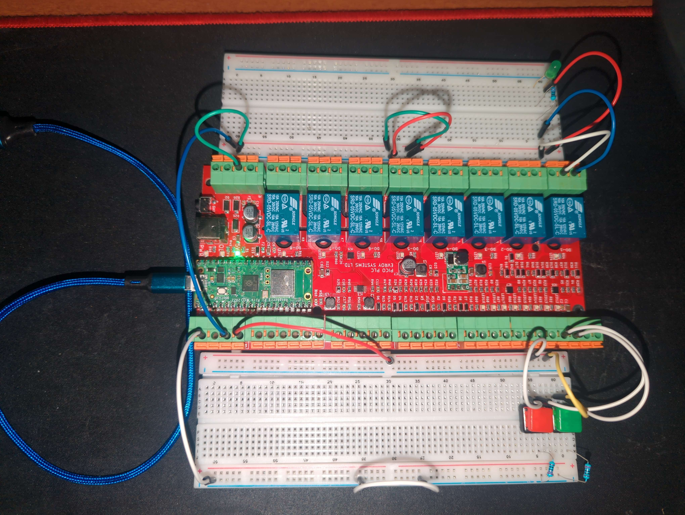

In the editor I defined 3 variables for my inputs and outputs:

| Name | Type | Location |
| ---- | ---- | -------- |
| PB1  | BOOL | %IX0.0   |
| PB2  | BOOL | %IX0.1   |
| LED  | BOOL | %QX0.0   |

Then I built a simple program with `PB1 & PB2` connected to an SR Latch (`PB1` being set, and `PB2` being reset) with the output connected to the `LED`.
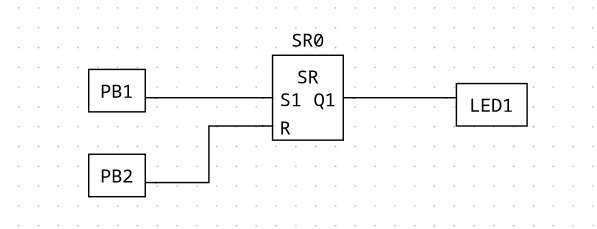
After uploading this to the `PLC` everything worked as intended.

### Issues

When first trying to get this circuit to work, I ran into an issue with the `LED` not turning on despite the `LED`'s corresponding relay lighting up upon pressing `PB1`. This was because I had a fundamental misunderstanding of how the output pins worked. I thought that `COM` was essentially equivalent to a `GND` pin and voltage would flow from `NO` when the relay was triggered. I tried changing pins around and even just connecting the `LED` from `NO` -> `GND`. I ended up finding John's repository for the Pico `PLC` (I think its incredible you two designed this board from scratch AND integrated it with the OpenPLC editor), along with the schematics for the board. Reviewing the schematics made it crystal clear that between `NC & COM & NO` was a dry circuit that only switched between `NC & NO` via the relay. This revelation prompted a paradigm shift in my thinking, and I wired the `LED` like so:

```
+3.3V----[LED]----[220 Ohm]----[NO]-
[COM]----[GND]-
```

This means that when the relay is switched by the SR latch output `NO` gets connected to `COM` which is connected to ground completing the circuit and routing `3.3V` through the
`LED`.

# Task 1

## Setting up my circuit with the `PLC`

I decided to completely rewire my circuit from scratch so it would conform nicely with the `PLC`s form factor. The main issue was that the output and input sides of the `PLC` are relatively far apart, and instead of just wiring a bunch of long jumper cables from the output side (which I didn't have enough of anyway) I split my circuit onto two breadboards. One breadboard would house input components and the other output.
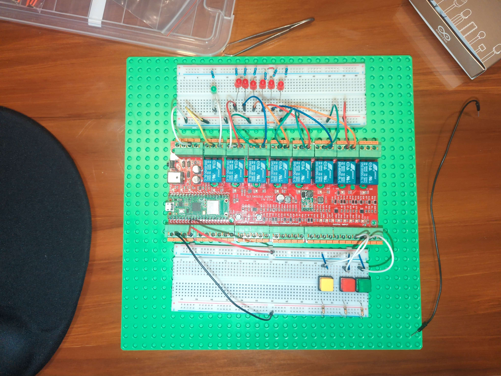
Connections:
Input:

- `Start_Stop` -> `IX0.2`
- `Temp_Up` -> `IX0.0`
- `Temp_Down` -> `IX0.1`
Output:
- `Status_Lamp` -> `QX0.7`
- `Temp_Display` -> `QX0.6 - QX0.1`

## Writing the program

While writing the program, I tested each block separately in the `PLC` simulation mode and made a table of tests performed on each block.

### On/Off Toggle

Included variables:

| Name           | Type | Location | Initial Value |
| -------------- | ---- | -------- | ------------- |
| In_Start_Stop  | BOOL | %IX0.2   |               |
| Out_Status_LED | BOOL | %QX0.7   |               |
| Heating_On     | BOOL |          | FALSE         |

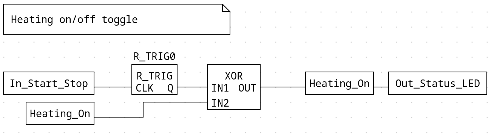
This block functions as a toggle for `Heating_On`. When an input signal is received from the push button, the value is passed to a `R_TRIG` block which generates a single pulse when a rising edge is detected (without this block `Heating_On` would be unpredictably recursively set true/false as long as the button is held). After that the signal is passed to an `XOR` block, which is also connected to the value of `Heating_On`. Each button press toggles the state: FALSE becomes TRUE, TRUE becomes FALSE. `Heating_On` also stored its values in `Out_Status_LED`.
***NOTE: I could of just used `Out_Status_LED` as an output and a state variable for the other blocks that rely on its value. However I figured it would be cleaner to distinguish between the output variable and the state variable.***

#### Performed Tests

| Test                                                | Expected Behavior            | Observed Behaviour |
| --------------------------------------------------- | ---------------------------- | ------------------ |
| Set `In_Start_Stop` TRUE when `Heating_On` is FALSE | `Heating_On` is set to TRUE  | Same as expected   |
| Set `In_Start_Stop` TRUE when `Heating_On` is TRUE  | `Heating_On` is set to FALSE | Same as expected   |

### Temperature Setting Controls

Included variables

| Name             | Type      | Location | Initial Value |
| ---------------- | --------- | -------- | ------------- |
| In_Temp_Up       | BOOL      | %IX0.0   |               |
| In_Temp_Down     | BOOL      | %IX0.1   |               |
| Heating_On       | BOOL      |          | FALSE         |
| MAX_TEMP_SETTING | CONST INT |          | 10            |
| Temp_Setting     | INT       |          | 0             |

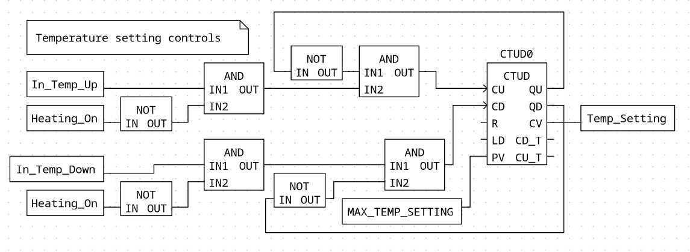
This block is responsible for handling the increment/decrement of the temperature setting. At the heart is a `CTUD` (Count Up/Down) block, with the following inputs/outputs utilised:

| Name | Type | Direction | Description                                         |
| ---- | ---- | --------- | --------------------------------------------------- |
| CU   | BOOL | Input     | On a rising edge, increments the counter value by 1 |
| CD   | BOOL | Input     | On a rising edge, decrements the counter value by 1 |
| PV   | INT  | Input     | Set point for the counter                           |
| CV   | INT  | Output    | The current value of the counter                    |
| QU   | BOOL | Output    | When `CV = PV` outputs TRUE                         |
| QD   | BOOL | Output    | When `CV <= 0` outputs TRUE                         |

`In_Temp_Up/Down` and `!Heating_On` are both fed into an `AND` gate, this means that the signal to increment/decrement the counter will only be passed through when the device is not heating. This signal is then put through another `AND` gate along with `!QU / !QD` respectively, this means that the counter will not count above `PV` (which is set to `MAX_TEMP_SETTING`) and won't count bellow 0 (the minimum temperature setting).
The output (`CV`) is then stored in `Temp_Setting`.

#### Performed Tests

| Test                                                                   | Expected Behavior                        | Observed Behaviour |
| ---------------------------------------------------------------------- | ---------------------------------------- | ------------------ |
| `In_Temp_Up` set TRUE while `!Heating_On` and `CV != MAX_TEMP_SETTING` | `CTUD` increments `CV` by 1              | Same as expected   |
| `In_Temp_Up` set TRUE while `Heating_On`                               | `CTUD` does not receive a signal to `CU` | Same as expected   |
| `In_Temp_Up` set TRUE while `!Heating_On` and `CV == MAX_TEMP_SETTING` | `CTUD` does not receive a signal to `CU` | Same as expected   |
| `In_Temp_Down` set TRUE while `!Heating_On` and `CV > 0`               | `CTUD` decrements `CV` by 1              | Same as expected   |
| `In_Temp_Down` set TRUE while `Heating_On`                             | `CTUD` does not receive a signal to `CD` | Same as expected   |
| `In_Temp_Down` set TRUE while `!Heating_On` and `CV <= 0`              | `CTUD` does not receive a signal to `CD` | Same as expected   |

### Temperature Setting Display

Included Variables:

| Name                 | Type | Location   | Initial Value |
| -------------------- | ---- | ---------- | ------------- |
| Out_Display_LED[0-5] | BOOL | %QX0.[6-1] |               |
| Heating_On           | BOOL |            | FALSE         |
| Temp_Setting         | INT  |            | 0             |

At first I tried using the Array type to make a map of outputs that would correspond to the correct LED/s using `Temp_Setting` as an address. Documentation for this editor is sorely lacking, and I just ended up hitting my head into a brick wall; my first hurdle was defining an array in the first place.
When trying to create an array in the editor it asked me to define the dimensions:

- "`10` isn't a valid array dimension!"
- "`1,10` isn't a valid array dimension!"
- "`1x10` isn't a valid array dimension!"
- "`[10]` isn't a valid array dimension!"
finally `0..10` was correct, which seemed completely nonsensical to me.
After that I was hoping it would be pretty straight forward to interface with it, but dropping a variable block for it gave me just a single output. I don't think there is a block for accessing an array by address, at-least I didn't find one. I'm pretty sure arrays were primarily intended to be used in the structured text language and it has been grafted on as an afterthought into the visual languages... but I could be completely wrong.

I also experimented with `SEL` and `MUX` blocks but in the end I went with this stupid simple, ridiculously verbose approach.

Each block simply checks if `Temp_Setting` is equal to that blocks corresponding setting, then if `!Heating_On` the display LED s that represent that setting are lit up.

#### Performed Tests

| Test                                                    | Expected Behavior                                                                                         | Observed Behaviour                                                                        |
| ------------------------------------------------------- | --------------------------------------------------------------------------------------------------------- | ----------------------------------------------------------------------------------------- |
| Increasing `Temp_Setting` from 0-10 while `!Heating_On` | As `Temp_Setting` increases the corresponding block should output TRUE to the correct `Out_Display_LEDx`s | While the correct connection goes high the actual values of the LED/s don't reflect this. |
| Increasing `Temp_Setting` from 0-10 while `Heating_On`  | No matter what `Temp_Setting` is, FALSE should be passed to the corresponding `Out_Display_LEDx`s         | While the correct connection goes high the actual values of the LED/s don't reflect this. |

#### Debugging

So whats going on here? ...
Lets think; when `Temp_Setting = 3` the program is trying to set `Out_Display_LED1/2` to TRUE, while simultaneously `LED1/2` is being set FALSE on the blocks above and below. Now that's what I'd call a data race, so no wonder the values aren't matching up.
So how can I go about fixing this?

Part of my problem was I was thinking about those blocks programmatically, as if they were if statements and the `LED` values were only being set when a signal got through, in reality each branch was setting the value simultaneously.
A better approach would be to have each LED be set when `Temp_Setting` is either value that LED corresponds to:

```
[SET]--[EQ]--\
[0]----/     [OR]--[LED0]
[SET]--[EQ]--/
[1]----/
... etc
```

***NOTE: Also when trying to debug the above `FBD` I realised you can connect an input to multiple outputs. The feature was just a bit weird to find, as the circle you needed to click would only show itself with the right finesse (kinda jank).***
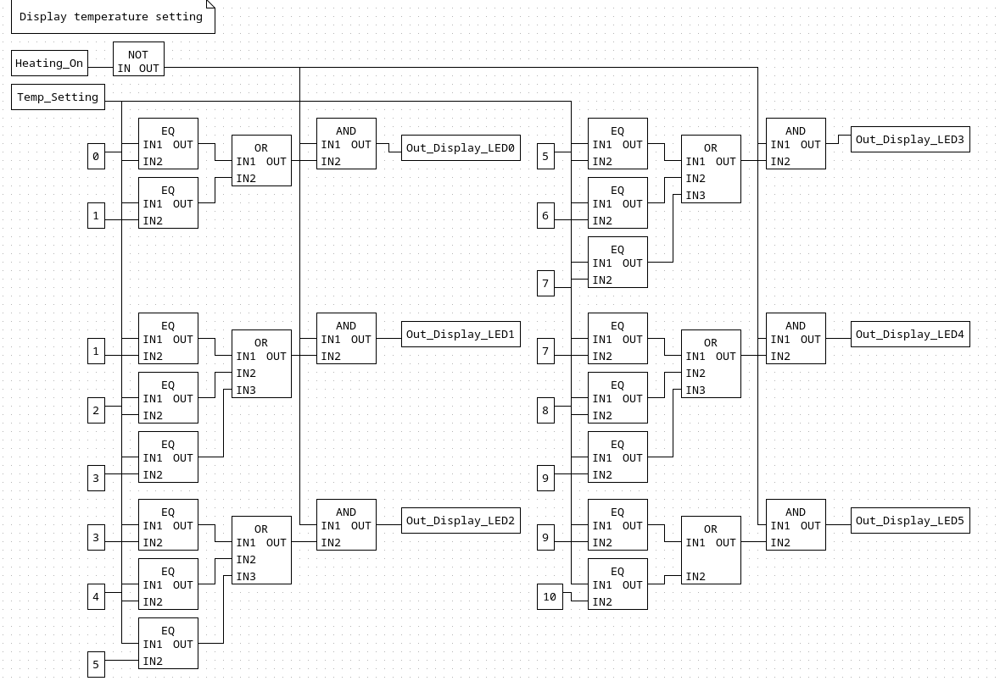
Here's the improved revision, free of data races. I could further improve this by using a `GE` and `LE` block and replace the `OR` with an `AND` for the `LED`s with 3 `EQ` blocks. However this is how I made it and I'm not going through the effort of rewiring it for the sake of one less block per the inner `LED`s.

#### Further Testing

| Test                                                    | Expected Behavior                                                                                          | Observed Behaviour |
| ------------------------------------------------------- | ---------------------------------------------------------------------------------------------------------- | ------------------ |
| Increasing `Temp_Setting` from 0-10 while `!Heating_On` | As `Temp_Setting` increases the corresponding block should output TRUE to the correct `Out_Display_LEDx`/s | Same as expected   |
| Increasing `Temp_Setting` from 0-10 while `Heating_On`  | No matter what `Temp_Setting` is, FALSE should be passed to the corresponding `Out_Display_LEDx`/s         | Same as expected   |

Finally!

### Simple temperature simulation

Included variables:

| Name        | Type | Location | Initial Value |
| ----------- | ---- | -------- | ------------- |
| Element_On  | BOOL |          | FALSE         |
| Temperature | REAL |          |               |

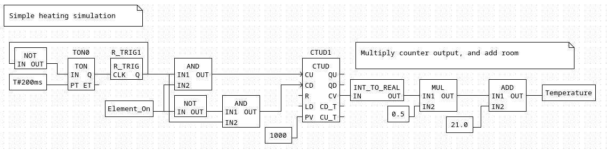
Since I don't have access to a boiler I am going to make a simple simulation (I am not going to implement newtons equations in `FBD`).
The simulation consists of a timer that ticks every 200 milliseconds and either increases or decreases a counter whether the element is on or not. The output is then multiplied by `0.5` (add 0.5 degrees every tick) and then `21.0` gets added (room temperature) before being stored in `Temperature`.

#### Performed Tests

| Test                               | Expected Behavior                                                           | Observed Behaviour |
| ---------------------------------- | --------------------------------------------------------------------------- | ------------------ |
| Observe counter when `Heating_On`  | `Temperature` should increase by `0.5` every tick until it maxes out at 521 | Same as expected   |
| Observe counter when `!Heating_On` | `Temperature` should decrease by `0.5` every tick until it reaches `21.0`   | Same as expected   |

### Refactoring 6 LED display

The LED display is not always going to display the temperature setting, when the device is in heating mode, it will instead show the recorded temperature. To address this I created a variable called `Display_Index` and hooked it up to the display inputs instead of `Temp_Setting`. Also now that the display will be used in both modes, I removed the `AND !Heating_On` condition on each `LED`.

| Name          | Type | Location | Initial Value |
| ------------- | ---- | -------- | ------------- |
| Display_Index | INT  |          | 0             |

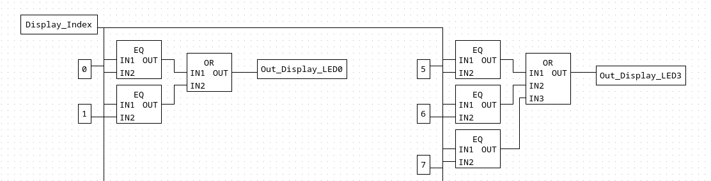
I ran the same tests from the last iteration and everything worked as expected.

#### Setting the Display Index

Included Variables:

| Name             | Type | Location | Initial Value |
| ---------------- | ---- | -------- | ------------- |
| Heating_On       | BOOL |          |               |
| Temp_Setting     | INT  |          |               |
| Temperature      | REAL |          |               |
| Display_Index    | INT  |          |               |
| MAX_TEMP_SETTING | INT  |          | 10            |

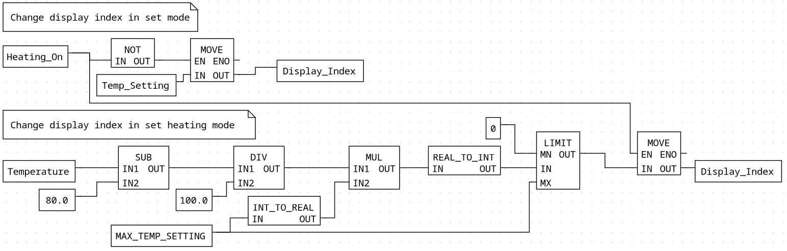
This block is responsible for setting `Display_Index` across both modes (set and heating). It uses move blocks with execution control which enables me to avoid a data race against the two instances of `Display_Index`. This works because on `MOVE` when `EN` is `FALSE`, the blocks after it are not executed.

When in set mode (`!Heating_On`), the `MOVE` block which takes `Temp_Setting` as input is enabled, the other disabled.
When in heating mode I calculate the display index from the current temperature:

$\Huge I = ((T - 80) / 100) * M$
where:

- I = `Display_Index
- T = `Temperature`
- M = `MAX_TEMP_SETTING = 10`

Next I convert the result back into an `INT`, my thought was that a `REAL_TO_INT` block would simply cut off the decimal point (effectively being a floor operation) but it actually rounds the value up/down depending on whether the decimal place is > or < 0.5. This is perfect for my use case, because if the `PID` controller is dancing around the desired temperature value (89.9 - 90.1) then without rounding, the display would end up flickering.

#### Performed Tests

***NOTE: I haven't implemented a `PID` to control `Element_On` yet, so I just hooked it up to the value of `Heating_On` for this test.***

| Test                                                 | Expected Behavior                                         | Observed Behaviour |
| ---------------------------------------------------- | --------------------------------------------------------- | ------------------ |
| Increase/decrease `Temp_Setting` while `!Heating_On` | `Display_Index` is set to match `Temp_Setting`            | Same as expected   |
| Turn heating on to let the temperature increase.     | `Temperature` is mapped to `Display_Index` with rounding. | Same as expected   |

### `PID` control loop

Included variables:

| Name         | Type | Location | Initial Value |
| ------------ | ---- | -------- | ------------- |
| Temp_Setting | INT  |          |               |
| Heating_On   | BOOL |          |               |
| Temperature  | REAL |          |               |
| Element_On   | BOOL |          |               |

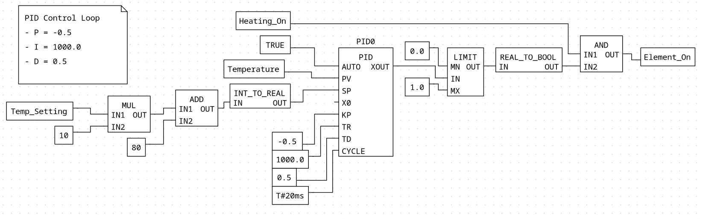
Here's my control loop; nothing too special. The Set-Point (`SP`) is calculated from the current `Temp_Setting` multiplied by 10 with an addition of 80. The Process-Variable (`PV`) is just the temperature. The `PID` cycles every `20ms` with:

- `KP (P) = -0.5` | `XOUT` was a negative value when the device needed to be heating, so I simply flipped it from positive to negative. I also chose a small value so it stays closer to `0`.
- `TR (I) = 1000.0` | I was experiencing issues with excessive windup so as a workaround, I set the integral really high. This reduces the integral term's influence, preventing windup.
- `TD (D) = 0.5` | After some testing I found this value was a good sweet-spot.
I attempted to fix the `PID` wind-up issue (where errors over-time accumulate while the device is in set-mode) I tried connecting `Heating_On` into `AUTO` so that the `PID` would only start calculating when necessary. However this actually caused a problem with the `PID` getting started in the first place and the output would keep flicking between `-/+` even when the `SP` and `PV` were far apart.
So instead I landed on my work around using a high integral value.

| Test                      | Expected Behavior                                                                                                                        | Observed Behaviour |
| ------------------------- | ---------------------------------------------------------------------------------------------------------------------------------------- | ------------------ |
| Start heating and observe | The `PID` should turn `Element_On` consistently until it reaches the desired set-point and then stabilise around the set-point `/- 0.2C` | Same as expected   |

#### Further Tuning

Later I revisited the `PID` to see if I could properly address wind-up. I reconnected `AUTO` to `Heating_On` and significantly reduced `TR (I)` value, which resolved the startup issue.
I spent an afternoon playing around with different values, but wasn't able to tune it quite right, and gave up in the end.
I originally assumed that `TR/D` were direct gain terms, but now believe they are referring to integral/derivative time constants (in seconds). Which led to confusion when tuning. Documentation for this block is missing (or at-least hard to track down), so what these terms actually influence is unknown.
I believe the main issue is that using a `PID` for a temperature control system is not a valid use-case. A `PID` expects that it is influencing the magnitude of the output but since my heating element only has two states and the output is either 0 or 100, a `PID` isn't very well suited to this situation.
Of course I am only using a `PID` in the first place, because it is required by the case-study. If I was implementing this program for use in production, I would instead opt for a more predictable logic based method:

```
if temperature < setpoint {
 Element_On = true
} else {
 Element_On = false
}
```

This control method worked a lot better in my previous circuit python revision. My guess is that because I implemented that `PID` from the ground up with bang-bang control in mind, limiting the error between 0 and 1 making it a viable control method. Because the `PID` block in OpenPLC has been configured for continuous control systems and error is not limited, it is much less suitable.

### Servo control

I first wired the servo to the board with these following connections:

- `DATA` -> `%QW0`
- `VCC` -> `5V`
Included variables:

| Name                  | Type | Location                                   | Initial Value |
| --------------------- | ---- | ------------------------------------------ | ------------- |
| `Out_Servo_PWM_Chann` | SINT | points to `%QW0` but not directly attached | 0             |
| `Servo_Freq`          | REAL |                                            | 50.0Hz        |
| `Servo_Angle`         | REAL |                                            | 0.0           |

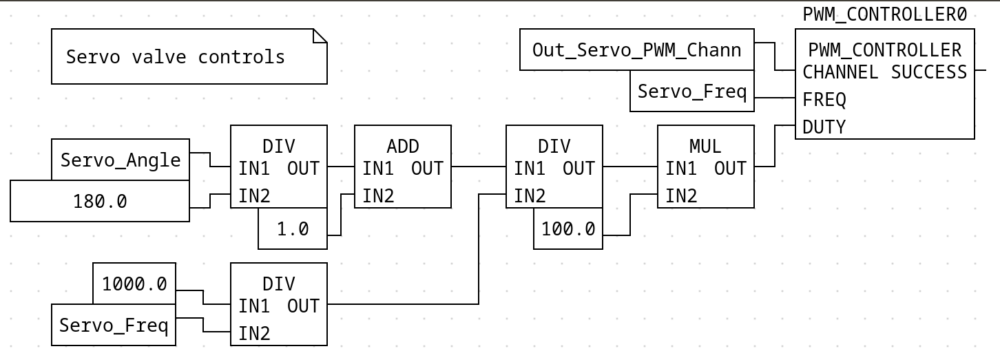
Servo motors are controlled through a `PWM` (Pulse-Width-Modulator). A `PWM` outputs a pulse of a defined length (in ms) during each "`PWM` period"; the servo will interpret the length of this pulse as the target angle. I am using the Tower Pro `MG90S` micro-servo that has the following dimensions for the `PWM` signal it expects:
[Datasheet](https://components101.com/motors/mg90s-metal-gear-servo-motor)

| Metric                         | Value           |
| ------------------------------ | --------------- |
| Duty Cycle (Pulse-width range) | `1.0 - 2.0 ms`  |
| `PWM` Perioid                  | `50Hz` (`20ms`) |
| Signal Voltage                 | `~5V`           |
| Angle range                    | 0-180 degrees   |

***NOTE: The voltage for `GP I/O` pins on the Raspberry Pico is only `3.3V` but I was able to get the servo to read the signal on the last revision so this shouldn't be an issue.***

I used the `PWM_CONTROLLER` block (from the "Arduino" library but it also should work with the `RP`), it has the following inputs/outputs:

| Name    | Direction | Type | Description                                                                                      |
| ------- | --------- | ---- | ------------------------------------------------------------------------------------------------ |
| CHANNEL | IN        | SINT | Maps to the analogue output pins on the board, channel 0 should be `%QW0` and 1 should be `%QW1` |
| FREQ    | IN        | REAL | The `PWM` period in Hertz                                                                        |
| DUTY    | IN        | REAL | The Pulse-width expressed as a percentage of the period.                                         |
| SUCCESS | OUT       | BOOL | TRUE when `PWM` is working successfully                                                          |

With the servos spec in mind the formula for converting an angle (degrees) to the correct pulse width percentage should be:
$\Huge D = (A/180 + 1) / (1000/F) * 100.0$
Where:

- D = Duty Cycle percentage
- A = Angle in degrees
- F = `50Hz` = Frequency of `PWM` Period.
The pulse width for my servo is between `1.0-2.0`, so ($A/180 + 1$) gets the width for the given angle in milliseconds. Then that value is divided by ($1000/F$) to convert the frequency to milliseconds and express the pulse width as a fraction. Finally it's multiplied by `100` to convert it to a percentage of the `PWM` period.

#### Testing and Debugging

To test the servo I set up this simple block to snap the angle between 0 and 90 degrees.
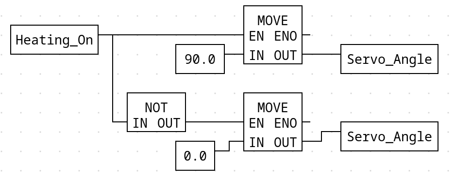
Before uploading my code to the Pico I made sure that the `PWM` was outputting `TRUE` with the values I was feeding to it. Alas it was not.
I changed `Out_Servo_PWM_Chann` to 1 which got the `PWM` to output `TRUE` and I moved on to the Pico Itself.
***NOTE: I had to reverse the order of digital output pins in the `I/O` config for them to match the locations set for the `LED`s.***

On the hardware the servo was not responding to my button presses, I thought that having to set the channel to 1 may have moved my output pin to the next `PWM` contact.  I re-connected the servos data-line to `PWM2` and got it to respond.
Whats happening is that using channel 1 is pointing to `%QW1` but I want to use the servo with `%QW0`, however for whatever reason the `PWM` doesn't like using channel 0.
***NOTE: My theory is that since this function-block is out of the Arduino section, channel 0 might be a reserved pin on Arduino boards and this block simply refuses to work with it.***
To fix this conundrum I simply added a dummy mapping in-front of the other 2 pins, in the `I/O` config.

```
Analogue Outputs:
0,4,5
```

Adding `0` as a dummy first entry shifted all channels: CHANNEL `1` now maps to `%QW0`, CHANNEL `2` to `%QW1`.

The next issue I observed was that the desired angle, and the real one were off. The 90 degree angle matched up where it should be, but from 90-0 the servo-horn only moved 45 degrees. ***NOTE: I also had this exact same issue on the last iteration using the Circuit Python Motor library but I didn't attempt to address it.***
Now this issue could be because the servo's desired signal height is `~5V` and it is only getting `3.3V` from the Pico (if this is the case I would not know how to solve it). Instead of calling it quits here I decided to map out the desired angle, with the associated pulse-width and the observed angle.  This was  to see if I could adjust the pulse-width range, just-in-case the data sheet was wrong.

| Input Angle (deg) | Pulse-width (ms) | Output Angle (deg) |
| ----------------- | ---------------- | ------------------ |
| 0                 | 1.0              | 45                 |
| 90                | 1.5              | 90                 |
| 180               | 2.0              | 135                |

It appears that the pulse-width range might actually be between 0.5-2.5 and the datasheet is nothing but lies!
I adjusted the conversion from angle to pulse-width (%) to:
$\Huge D = (A/90 + 0.5) / (1000/F) * 100.0$
and tested it on the hardware. With this adjusted range, input angles matched with the observed angles, and I had the full 0-180 degrees of rotation unlocked at last!

### Valve Control

Now that I have control over the servo, I need to implement the water valve mechanism. When `Heating_On` the valve should open to 80% of its max angle (144 degrees), and when `!Heating_On` the valve should close to 0% of its max angle. The valve should transition between these two states  at a rate of 5% (9 degrees) per 500 ms, to avoid the water hammer effect (aka hydraulic shock).
I also want the transition to be smooth, so I will update the servo every 100 ms at a rate of 1% (1.8 degrees).

Include Variables:

| Name        | Type | Location | Initial Value |
| ----------- | ---- | -------- | ------------- |
| Heating_On  | BOOL |          |               |
| Servo_Angle | REAL |          | 0.0           |

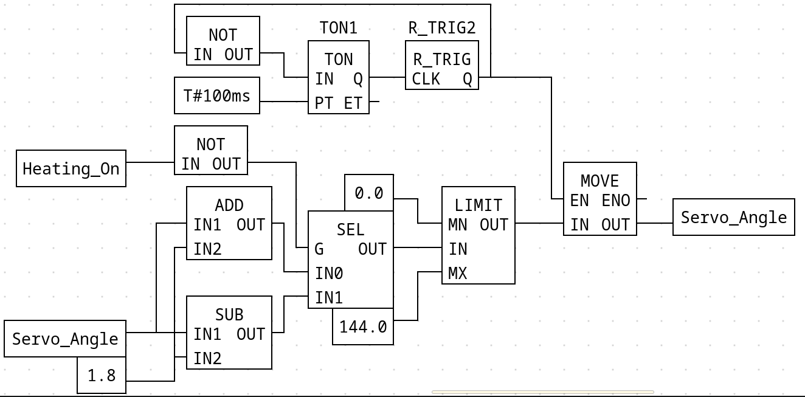
This block adds/subtracts 1% (1.8 deg) from the current value of `Servo_Angle`, selects which one to use with a `SEL` block, based on the value of `Heating_On`, limits the value between 0-80% (0-144 deg) and then a timer that ticks every 100 ms triggers a `MOVE` block to store the modified value back into `Servo_Angle`.
This meets the above requirements I laid out.

#### Performed Tests

| Test                                               | Expected Behavior                                                           | Observed Behaviour |
| -------------------------------------------------- | --------------------------------------------------------------------------- | ------------------ |
| Set `Heating_On = TRUE` and observe `Servo_Angle`  | `Servo_Angle` increases at 18 deg/s until reaching a maximum of 144 degrees | Same as expected   |
| Set `Heating_On = FALSE` and observe `Servo_Angle` | `Servo_Angle` decreases at 18 deg/s until reaching a minimum of 0 degrees   | Same as expected   |

### Emergency Stop

The final piece of the puzzle is an emergency stop button, which isn't necessary in the device's current prototype phase but will prove useful in future iterations where safety is critical. I started by adding a fourth push button with the following connected to `%QX0.3`.
Included Variables:

| Name              | Type | Location | Initial Value |
| ----------------- | ---- | -------- | ------------- |
| In_Emergency_Stop | BOOL | `%IX0.3` |               |
| Emergency_Stop    | BOOL |          | FALSE         |
| Global_Enable     | BOOL |          | TRUE          |

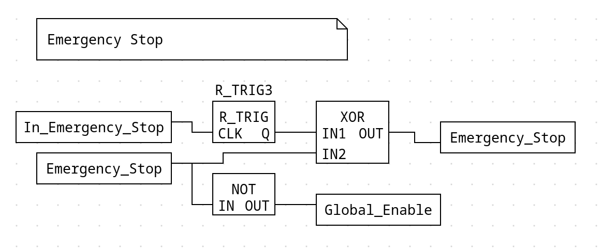
I copied the same toggle mechanism, but used it with the new push button and the `Emergency_Stop` variable. I also added a `Global_Enable` which just acts as a short-hand for `!Emergency_Stop`.
After that I modified two program blocks to take into account the new emergency state. Specifically `Heating_On` toggle block, and the `Display_Index` block.
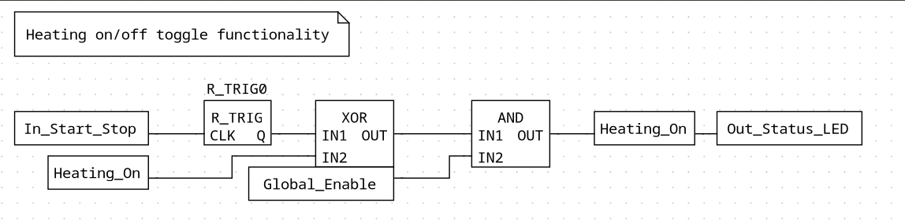
I added an AND gate and connected to it `Global_Enable`, so when `Emergency_Stop = TRUE` it will force `Heating_On = FALSE`.
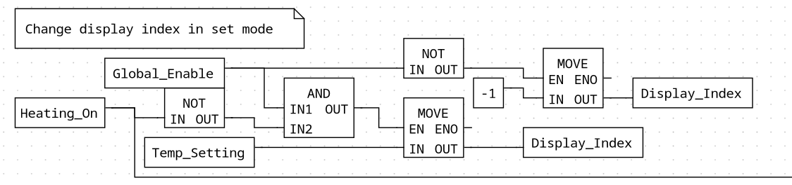
I want it to be obvious when the device's function has been overridden by an emergency stop. To achieve this I added a third branch to the display index block, that will load -1 into the index when `Emergency_Stop = TRUE` and effectively disable the display. The valve will also close automatically when `Heating_On = FALSE`.
***NOTE: I didn't incorporate `Global_Enable` into the MOVE block responsible for setting the display index when the device is in HEATING mode, because `Heating_On` will always be FALSE when `Emergency_Stop = TRUE`***

### Performed Tests

| Test                                      | Expected Behavior                                       | Observed Behaviour |
| ----------------------------------------- | ------------------------------------------------------- | ------------------ |
| Activate `Emergency_Stop` in SET mode     | `Heating_On` will remain FALSE, and display is disabled | Same as expected   |
| Activate `Emergency_Stop` in HEATING mode | `Heating_On` will switch FALSE, and display is disabled | Same as expected   |

## Circuit Diagram

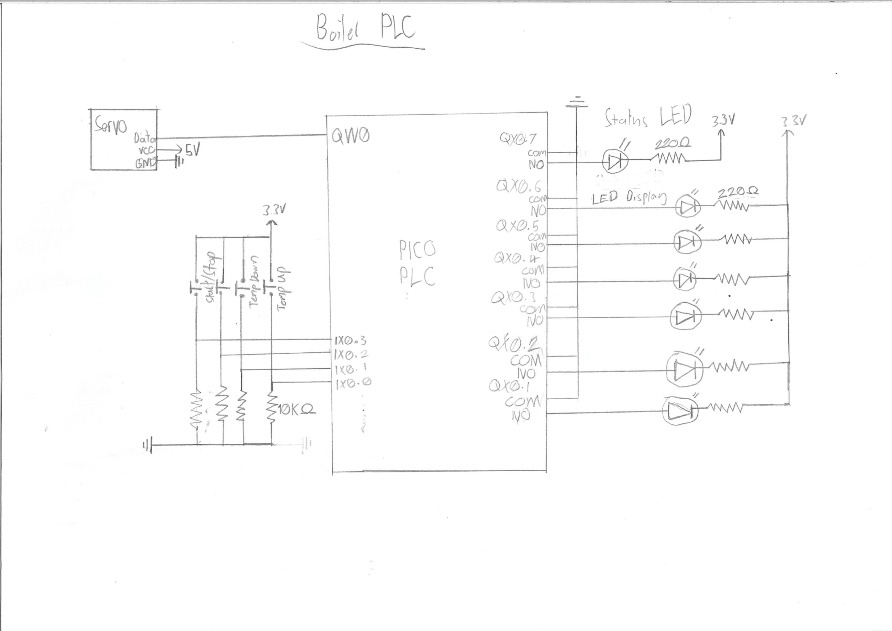

### Final Hardware Tests

| Test                                                      | Expected Behavior                                                                                                                                                                                      | Observed Behaviour |
| --------------------------------------------------------- | ------------------------------------------------------------------------------------------------------------------------------------------------------------------------------------------------------ | ------------------ |
| While in SET mode, change the desired temperature setting | Pressing the green/red push buttons will cause the LED display to increment / decrement the current setting by 1                                                                                       | Same as expected   |
| Changing to HEATING mode from SET mode                    | Green status LED will come on, temperature display will show the actual temperature (simulated), and servo will open to 144 degrees at 18 deg/s                                                        | Same as expected   |
| Try to change temperature setting while in HEATING mode   | Nothing will happen                                                                                                                                                                                    | Same as expected   |
| Switch back to SET mode from HEATING mode                 | LED display will switch back to showing the current setting remembering the last one that was set, servo will close back to 0 degrees at 18 deg/s, and user will be able to change the set-point again | Same as expected   |
| Press emergency stop button                               | LED display is disabled and heating is turned off                                                                                                                                                      | Same as expected   |

## `UX/UI` complaints

While this editor has a solid foundation, and I think its immediately preferable to the horrendously expensive, proprietary alternatives; the `UX` needs a lot of work. So here is a list of potential improvements:

- When toggling boolean values in the simulation, you need to go through a popup interface for a total of 4 button presses. You should just be able to toggle with a single click.
- The `FBD` interface generally performs terribly when you zoom in/out quickly, move around, or select and move lots of blocks.
- Variable window clutters up the interface, and editing information is kind of janky and unresponsive (sometimes I need to give an entry a good 4 clicks to edit). Should be in a separate tab or detached window.
- Wires sometimes don't adhere to grid and wobble back and forth between snap points when trying to move their joints.
- Documentation lacking.
If I get around to it, I could have a look through their source code and see if I can make some improvements.

# Task 2

Now that the program is written I want to be able to see and control the device's state over serial. I can achieve this by installing the OpenPLC Runtime. Setting up my host computer as the master and the PLC as a slave.

## Installing OpenPLC runtime

The runtime's installation script doesn't natively support my distro (Arch Linux), I tried installing it using the `custom` argument, and even with all the required dependencies it failed to compile. I also built and ran it using a docker container but experienced issues, with persistent state (restarting the runtime caused it to lose everything I had setup prior) and issues communicating to the actual PLC. My solution was to setup a Debian virtual machine and virtualise the runtime. This will not only fix my issues, but also make sense as it will simulate the type of operating system the runtime would actually be running on in an industrial setting.
After installing the VM with Oracle Virtual-Box, I disabled the login manager (`gdm`) service to boot into a `tty1` text environment since I just want to start the runtime and access it from the host.
Then I cloned and installed the OpenPLC runtime:

```
git clone https://github.com/thiagoralves/OpenPLC_v3.git
cd OpenPLC_v3
./install.sh linux
```

### Configuring serial ports

In Virtual Box by default serial ports aren't passed through. I had to configure my VM to pass through `/dev/ttyACM0` so the runtime could access it. Next on the VM, I installed to `setserial` package to manage the ports and ran `dmesg` to confirm it was connected:

```
dmesg | grep tty
```

Which confirmed it was connected to `/dev/ttyS0` with the correct baud rate. Also I added my user to the `dialout` group to give it permissions to read and write to the port.
Since I want to connect to the server on my host computer, another thing I did was change the VM network interface to a bridged adaptor.

With everything configured I started the runtime:
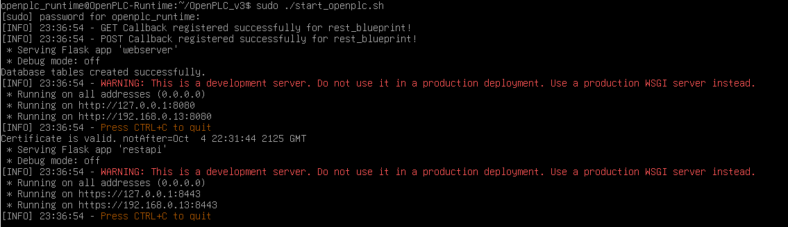
I should now be able to connect to it by going to the address it provided.
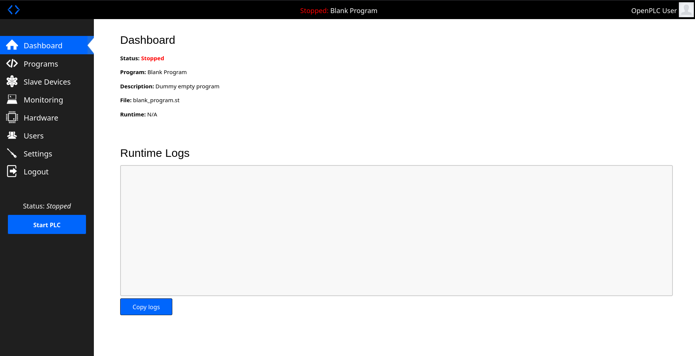
Success!

## Setting up a slave device

In the editor I went to the transfer dialogue and enabled the Modbus RTU serial communication protocol, configured as follows:

In the OpenPLC web interface, I navigated to the 'Slave Devices' section and added a new device with the following configuration.
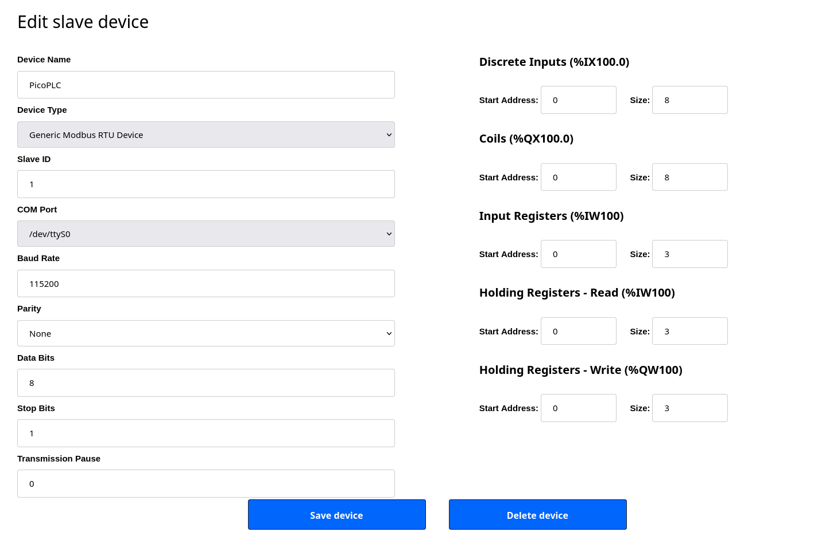
I specifically changed the following values:

- COM Port: `/dev/ttyS0`
- Slave ID: set to 1, matching up with the ID set when transferring from the editor to the PLC.
- Baud Rate: 115200
- Inputs/Outputs: I changed the `IW/QW` addresses to match the I/O mapping I set in the editor.

## Uploading a program

When uploading my PLC program to the runtime it wouldn't compile when using the `PWM_CONTROLLER` block, probably because it is from the Arduino function-block library, and is non-standard. I couldn't figure out how to include the non-standard blocks, so in a future iteration I will probably just make my own `PWM` out of standard blocks.
I also changed the input/output addresses in my program to match the new addressing when communicating to the PLC over serial. Address `%QX0.1` became `%QX100.1` because in OpenPLC's memory mapping, device addresses typically start at offset 100 to avoid conflicts with local I/O. Running the program in the runtime, reports that the "PicoPLC" Modbus device has been successfully connected, and I can monitor the input/outputs:
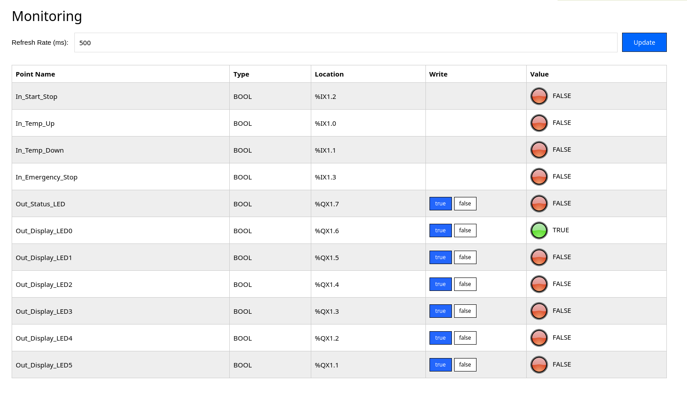
However these values don't update as I use the PLC, and the servo is still working, implying that the local program is overriding the communications from the runtime. Also when trying to write to values I get the following error:

```
Modbus Write Coils failed on MB device PicoPLC: Connection timed out
Modbus Read Input Registers failed on MB device PicoPLC: Connection timed out
```

Before connecting again right after...

The problem here is that I haven't configured my device to be a Modbus slave, and it is still running my original program. After reading through this [article](https://autonomylogic.com/docs/2-6-slave-devices/) in the OpenPLC documentation, I downloaded their provided blank project for achieving this and flashed the Pico with it (making sure to configure the I/O correctly and re-setup the serial configuration).
Now the program is running off the runtime as expected, and the input/outputs update, and are writable. Also there is now a notable delay between pressing a button and the outputs responding. This is because now the signal for an input needs to be transmitted from the board to the host, and then back from the host to the board. This is also definitely exacerbated by virtualisation.

# Conclusion

I had a great time working with OpenPLC and learnt a lot, despite the editors quirks and lacking documentation. Function Block Diagram was very interesting to work with, and while I would still prefer a text based language for my own projects. The concept of representing a program with discrete logic blocks has a lot of benefits, mainly the ease of debugging and fact that any electrical engineer could immediately read a program and know what it does. Which is crucial in an industrial setting where a program might need fixing but no one around knows how to read C for example.
I have also learned that I really enjoy some embedded programming and plan on purchasing some hardware for my self, the current idea I have is recreating pong with a Pico on an LCD. While not quite as ingenious as the original pong, it would still be a fun project.

# References

- [OpenPLC documentation](https://autonomylogic.com/docs/openplc-overview/)
- [PLC Academy's Function Block Diagram Tutorial](https://www.plcacademy.com/function-block-diagram-programming/)
- [Schneider Electric IEC 61131-3 Function / Function Block Library](https://product-help.schneider-electric.com/Machine%20Expert/V1.1/en/plc_fbfun/index.htm#t=topics%2Ffufbhelp.htm)
- [DeepSeek R1](https://www.deepseek.com/en) used but not abused. No AI generated text, or FBD/circuits is used in this write up and project. I used Deep Seek to help learn concepts, give pointers, and validate/improve on my original ideas, while interrogating and fact checking the hell out of it along the way.
