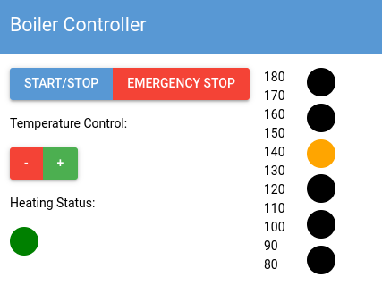
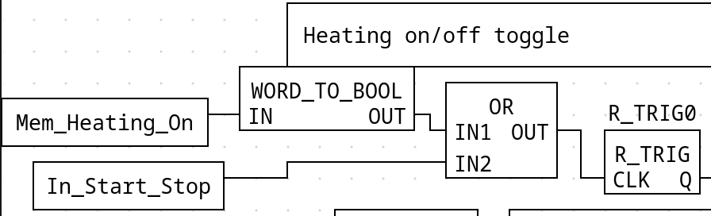

# GUI

After acclimating myself to using NiceGUI I built a simple interface for the boiler controls.
The layout is rooted in a 2 column grid, with inputs and status LED on the left and the 6 LED output display on the right.

```python
with ui.grid(columns=2):
    with ui.column(): # Control Column
  ...

    with ui.column(): # Display Column
     ...
```

In the first column I setup the elements as follows:

```python
...
with ui.column(): # Control Column
 with ui.button_group():
  ui.button("Start/Stop")
  ui.button("Emergency Stop", color="red")
 ui.label("Temperature Control:")
 with ui.button_group():
  ui.button("-", color="red", on_click=dec_temp)
  ui.button("+", color="green", on_click=inc_temp)
 ui.label("Heating Status")
 heating_status_display = Circle(32, "black")
```

I wanted the display to be the same 6 LED format per the case study, opposed to just using a number to show the temperature and setting.
First I created a `Circle` class that inherits from a generic element and uses the `border-radius` field to display a circle.

```python
class Circle(ui.element):
    def __init__(self, r: int, color: str):
        super().__init__("div")
        self.style(f"border-radius: 50%; width: {r}px; height: {r}px; background-color: {color};")
    def set_color(self, color: str):
        self.style(f"background-color: {color};")
```

Then I setup the elements for the display:

```python
with ui.column(): # Display Column
        with ui.grid(columns=2).classes('items-center gap-4'):
            with ui.column().classes('gap-0 justify-between h-full'):
                for i in range(0, MAX_SETTING+1):
                    ui.label(f"{80+i*10}")
            with ui.column().classes('gap-0 justify-between h-full'):
                for i in range(0, DISPLAY_COUNT):
                    display.append(Circle(32, "black"))
```

Each circle is stored in a global array (`display`) to be updated later when the display changes.
Then I implemented some logic for changing the temperature setting and display for testing purposes.

```python
def update_display():
    global temp_setting, display

    for c in display:
        c.set_color("black")
    address_map = [
        [0],
        [0, 1],
        [1],
        [1, 2],
        [2],
        [2, 3],
        [3],
        [3, 4],
        [4],
        [4, 5],
        [5]
    ]
    for i in address_map[temp_setting]:
        display[i].set_color("orange")

def inc_temp():
    global temp_setting
    if temp_setting < MAX_SETTING:
        temp_setting += 1
        update_display()

def dec_temp():
    global temp_setting
    if temp_setting > 0:
        temp_setting -= 1
        update_display()
```

Running this script produced the following UI, working as intended.


# Modbus

When writing my implementation for communicating to the PLC via serial I want to create an encapsulated abstraction that is portable to any other project using a PicoPLC.
Using the Modbus addressing outlined in the OpenPLC documentation I wrote the following class.

```python
class PLC_ModBusInterface:
    def __init__(self, device_id: int = 1):
        self.id = device_id
        self.connected = False

    def connect(self):
        serial_port = find_plc()
        if len(serial_port):
            self.client = ModbusSerialClient(port=serial_port, baudrate=115200)
            self.connected = self.client.connect()
            if not self.connected:
                print(f"Failed to connect to PicoPLC via serial port {serial_port}")
            else:
                print(f"Successfully connected to PicoPLC via serial port {serial_port}")

    # ---- I/O Usage ---- #
    # I/O functions reads/writes 'n' registers from the 'start' address

    # Read registers %IX (code: 0x02)
    def read_inputs(self, start: int, n: int) -> list[bool]:
        return self.client.read_discrete_inputs(start, count=n, device_id=self.id).bits
    
    # Read registers %IW (code: 0x04)
    def read_analogue_inputs(self, start: int, n: int) -> list[int]:
        data = self.client.read_input_registers(start, count=n, device_id=self.id)
        # Convert received bits (16 per int) to integers
        return bits_to_ints(data.bits, 16)

    # Read registers %QX (code: 0x01)
    def read_outputs(self, start: int, n: int) -> list[bool]:
        return self.client.read_coils(start, count=n, device_id=self.id).bits

    # Read registers %QW (code: 0x03)
    def read_analogue_outputs(self, start: int, n: int) -> list[int]:
        data = self.client.read_holding_registers(start, count=n, device_id=self.id)
        return bits_to_ints(data.bits, 16)

    # Write registers %QX (code: 0x0F)
    def write_outputs(self, start: int, bits: list[bool]):
        self.client.write_coils(start, bits, device_id=self.id)

    # Write registers %QW (code: 0x10)
    def write_analogue_outputs(self, start: int, values: list[int]):
        self.client.write_registers(start, values, device_id=self.id)

    # Memory Registers:
    # read code: 0x03
    # write code: 0x10
    # I16 - address range 32-51
    # I32 - address range 52-91
    # I64 - address range 92-171
    offsets = { # Use Memory type enum to easily determine the correct offset
        MemoryType.I16: 32,
        MemoryType.I32: 52,
        MemoryType.I64: 92,
    }
    def read_memory(self, type: MemoryType, start: int, n: int) -> list[int]:
        offset = self.offsets[type]
        data = self.client.read_holding_registers(offset + start, count=n, device_id=self.id)
        return bits_to_ints(data.bits, type.value)

    def write_memory(self, type: MemoryType, start: int, values: list[int]):
        offset = self.offsets[type]
        self.client.write_registers(offset + start, values, device_id=self.id)
```

This implementation takes care of the setup boiler plate and gives me an easy to use interface for reading and writing the PLC's registers.

## Connecting to the Pico

I was having issues connecting to the Pico and would get an error saying that an **exclusive** connection couldn't be established. I found out that this was because NiceGUI (even when reload is turned off) will run all the code in the script twice, and the original process had locked the serial port. While the second child process is left with out a connection and panics. I tried a few different solutions from a GitHub issue [3.] thread on the topic but didn't find anything that could help me.

I eventually discovered that connecting to the PLC from a different python module and then importing it into my NiceGUI script worked great.

```python
# connect.py
from plc_modbus_interface import PLC_ModBusInterface

plc = PLC_ModBusInterface()
plc.connect()
if not plc.connected:
    exit()
```

After that I can import `plc` from `connect.py` and use it.

## Mirroring Display

Now that I've successfully connected to the Pico I am going to start with mirroring the display on the physical controller. I defined a `poll_plc` function connected to a `ui.timer` with an interval of 300 ms. It reads relevant output contacts from the Pico and updates the digital display accordingly.

```python
def poll_plc():
    # Read LED display %QX0.1-6 and update HMI display 
    out = plc.read_outputs(1, 6)[:6]
    #out.reverse()

    i = 0
    for pin in out:
        if pin: # idk why but you have to compare to True for this if to fire
            display[i].set_color("orange")
        else:
            display[i].set_color("black")
        i += 1

    # Read status led
    if plc.read_outputs(7, 1)[0]:
        heating_status_display.set_color("green")
    else:
        heating_status_display.set_color("black")
```

This incredibly worked on the first try and the digital display updated according to the physical device.

## Remote Controls

Before I went further I made some changes to my `FBD` program so I can write to certain variables to control the PLC. Since I cannot write to input registers I created the following variables:

| Name               | Type | Location |
| ------------------ | ---- | -------- |
| Mem_Heating_On     | WORD | %MW0     |
| Mem_Emergency_Stop | WORD | %MW1     |
| Mem_Temp_Up        | WORD | %MW2     |
| Mem_Temp_Down      | WORD | %MW3     |

These variables act as a second input signal for their related function-blocks, combined by an `OR` with the push button signal.


In my python code I added the following function for signalling a register.

```python
def signal_register(addr: int):
    plc.write_memory(MemoryType.I16, addr, [1])
    time.sleep(0.02)                 # Janky method of simulating a button press
    plc.write_memory(MemoryType.I16, addr, [0])
```

This code simulates the same sort of signal you'd get from a push button. This is not an ideal solution for remote control but it gets the job done and is really easy to slap onto my existing `FBD` without to much refactoring.

Now all I need to do is connect `signal_register` to my buttons:

```python
...
with ui.button_group():
    ui.button("Start/Stop", on_click=lambda: signal_register(0))
    ui.button("Emergency Stop", color="red", on_click=lambda: signal_register(1))
ui.label("Temperature Control:")
with ui.button_group():
    ui.button("-", color="red", on_click=lambda: signal_register(3))
    ui.button("+", color="green", on_click=lambda: signal_register(2))
...
```

Incredibly this also worked on the first try and I have finished the `HMI`.

# Conclusion

NiceGUI was pretty nice to work with, however the issues caused by there being a second child process was still frustrating and took a while to come to a solution. I also expected using ModBus would be a bit of a headache, but was pleasantly surprised by the ease of use `pyModbus` provided. All parts of this project are now complete. Overall it was a fun journey and I have come away with much stronger knowledge on the topic.

# References

1. [NiceGUI docs](https://nicegui.io/documentation)
2. [OpenPLC Modbus Addressing](https://autonomylogic.com/docs/2-5-modbus-addressing/)
3. [GitHub Issue on NiceGUI reloads](https://github.com/zauberzeug/nicegui/issues/794)
